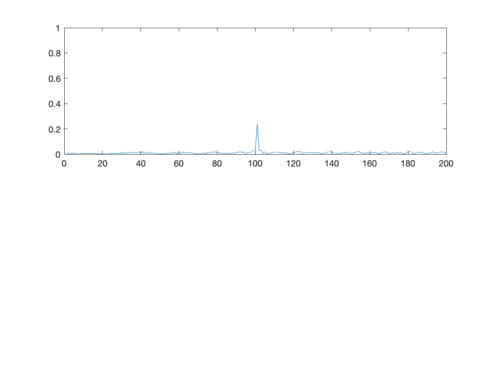
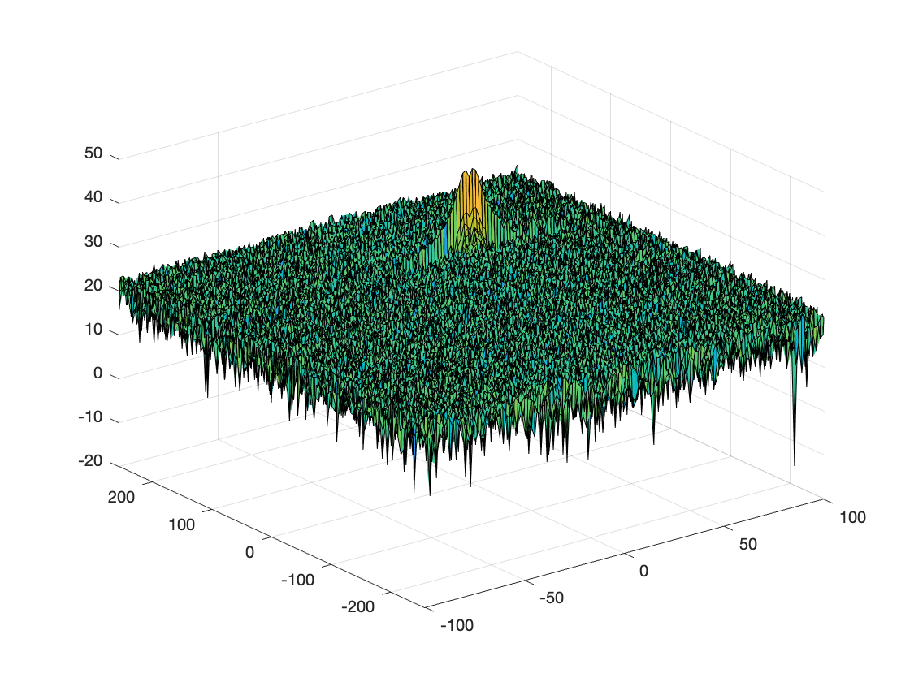
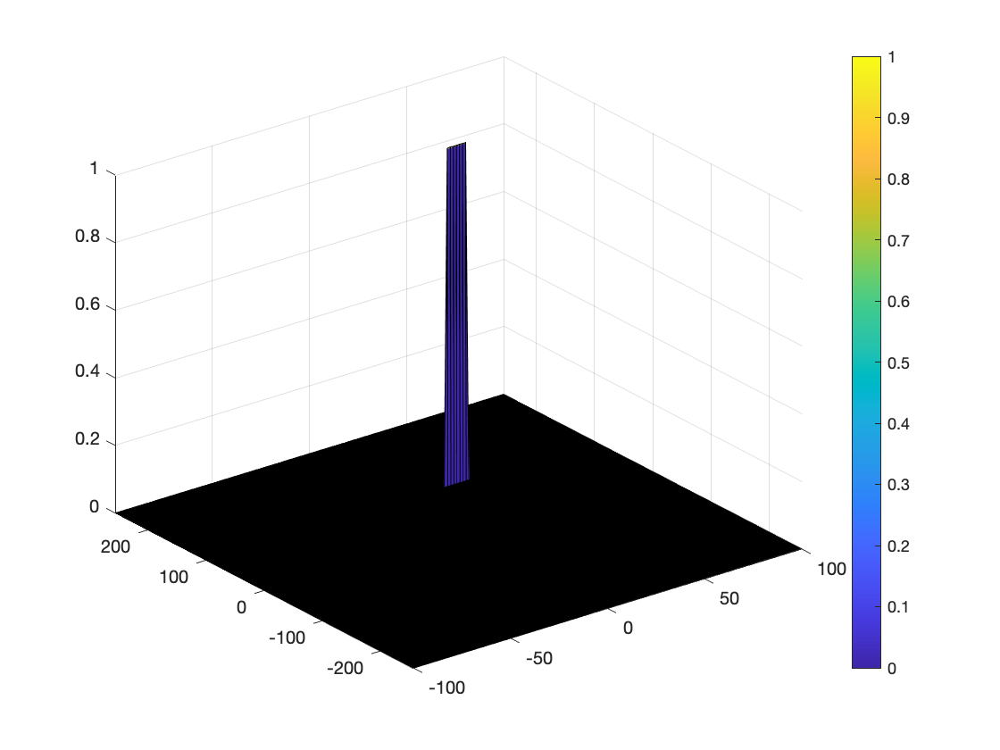

# SFND Radar Generation and Detection
## George V. Paul
[Github link to this project is here](https://github.com/gvp-study/SFND_Radar_Generation_and_Detection.git)

Write a README outlining the following:
1. Implementation steps for the 2D CFAR process.
2. Selection of Training, Guard cells and offset.
3. Steps taken to suppress the non-thresholded cells at the edges.


The range and velocity of target is set at 100m and 30m/sec. The FMCW wave is generated with formulae from the lesson as shown below.

```Matlab
% define the target's initial position and velocity. Note : Velocity
% remains constant

c = 3e8;
target_pos = 100;
target_vel = 30;


%% FMCW Waveform Generation

% *%TODO* :
%Design the FMCW waveform by giving the specs of each of its parameters.
% Calculate the Bandwidth (B), Chirp Time (Tchirp) and Slope (slope) of the FMCW
% chirp using the requirements above.

B_sweep = c/(2*range_resolution); %Calculate the Bandwidth (B)

T_chirp = 5.5*2*max_range/c;

slope = B_sweep/T_chirp;


%Operating carrier frequency of Radar
fc = 77e9;             %carrier freq


%The number of chirps in one sequence. Its ideal to have 2^ value for the ease of running the FFT
%for Doppler Estimation.
Nd = 128;                   % #of doppler cells OR #of sent periods % number of chirps

%The number of samples on each chirp.
Nr = 1024;                  %for length of time OR # of range cells

% Timestamp for running the displacement scenario for every sample on each
% chirp
t = linspace(0,Nd*T_chirp,Nr*Nd); %total time for samples


%Creating the vectors for Tx, Rx and Mix based on the total samples input.
Tx = zeros(1,length(t)); %transmitted signal
Rx = zeros(1,length(t)); %received signal
Mix = zeros(1,length(t)); %beat signal

%Similar vectors for range_covered and time delay.
r_t = zeros(1,length(t));
td = zeros(1,length(t));


%% Signal generation and Moving Target simulation
% Running the radar scenario over the time.

for i=1:length(t)         

    % *%TODO* :
    %For each time stamp update the Range of the Target for constant velocity.
    r_t(i) = target_pos + (target_vel*t(i));
    td(i) = 2*r_t(i)/c; % Time delay

    % *%TODO* :
    %For each time sample we need update the transmitted and
    %received signal.
    Tx(i) = cos(2 * pi * (fc * t(i) + slope * (t(i)^2)/2));
    Rx(i) = cos(2 * pi * (fc * (t(i) - td(i)) + slope * ((t(i)-td(i))^2)/2));

    % *%TODO* :
    %Now by mixing the Transmit and Receive generate the beat signal
    %This is done by element wise matrix multiplication of Transmit and
    %Receiver Signal
    Mix(i) = Tx(i).* Rx(i);

end
```
Once the received signal is obtained, a 1D FFT in the range space is run on it to obtain the range as shown below.

Clearly the peak shows that there is a target at range = 100m.

# FP.1: Implementing the 2D CFAR
The received radar signal when passed through a 2D Range/Doppler FFT results in a range doppler map as shown below.


The next step is to implement the 2D CFAR on this Range Doppler Map.

The steps to obtain the 2D CFAR is as follows:
* Determine the number of Training cells for each dimension. Similarly, pick the number of guard cells.
* Slide the cell under test across the complete matrix. Make sure the CUT has margin for Training and Guard cells from the edges.
* For every iteration sum the signal level within all the training cells. To sum convert the value from logarithmic to linear using db2pow function.
* Average the summed values for all of the training cells used. After averaging convert it back to logarithmic using pow2db.
* Further add the offset to it to determine the threshold.
Next, compare the signal under CUT against this threshold.
* If the CUT level > threshold assign it a value of 1, else equate it to 0.

The process above will generate a thresholded block, which is smaller than the Range Doppler Map as the CUTs cannot be located at the edges of the matrix due to the presence of Target and Guard cells. Hence, those cells will not be thresholded.

* To keep the map size same as it was before CFAR, equate all the non-thresholded cells to 0.

The Matlab code for this is below.

```Matlab
%design a loop such that it slides the CUT across range doppler map by
%giving margins at the edges for Training and Guard Cells.
%For every iteration sum the signal level within all the training
%cells. To sum convert the value from logarithmic to linear using db2pow
%function. Average the summed values for all of the training
%cells used. After averaging convert it back to logarithimic using pow2db.
%Further add the offset to it to determine the threshold. Next, compare the
%signal under CUT with this threshold. If the CUT level > threshold assign
%it a value of 1, else equate it to 0.
   % Use RDM[x,y] as the matrix from the output of 2D FFT for implementing
   % CFAR
 RDM = RDM/max(max(RDM)); % Normalizing
 area = (2*(Td+Gd+1)*2*(Tr+Gr+1)-(Gr*Gd)-1);
 for i = Tr+Gr+1:(Nr/2)-(Tr+Gr)
     for j = Td+Gd+1:(Nd)-(Td+Gd)
         % Noise level accumulator
         noise_level = zeros(1,1);
         % Add the noise in the 2D window around the CUT, except guard cells.
         for k = i-(Tr+Gr) : i+(Tr+Gr)
             for l = j-(Td+Gd) : j+(Td+Gd)
                 if (abs(i-k) > Gr || abs(j-l) > Gd)
                     noise_level = noise_level + db2pow(RDM(k,l));
                 end
             end
         end

         % Calculate threshold from noise average + offset
         threshold = pow2db(noise_level/area) + offset;

         % Threshold the signal in Cell Under Test(CUT)
         CUT_signal = RDM(i,j);

         if (CUT_signal < threshold)
             RDM(i,j) = 0;
         else
             RDM(i,j) = 1;
         end

     end
 end

```
# FP.2: Selecting Training, Guard Cells and offset
The window used for the cell under test (CUT) with training and guard cells for both the range and doppler axis as shown below. I adjusted the Tr, Td, Gr and Gd values to reduce computation while still detecting the target accurately.


```Matlab
%Select the number of Training Cells in both the dimensions.

Tr = 10;
Td = 5;

% *%TODO* :
%Select the number of Guard Cells in both dimensions around the Cell under
%test (CUT) for accurate estimation

Gr = 4;
Gd = 2;

% *%TODO* :
% offset the threshold by SNR value in dB
offset = 1.4;

% *%TODO* :
%Create a vector to store noise_level for each iteration on training cells
noise_level = zeros(1,1);

```

# FP.3: Thresholding at the edges
The edges of the RDM which was not processed by the previous CFAR algorithm is now set to 0 as shown below.

```Matlab
RDM(RDM~=0 & RDM~=1) = 0;

```
The result is the clean detection of the target with a range at 100m and a mean velocity of 30m/sec.


